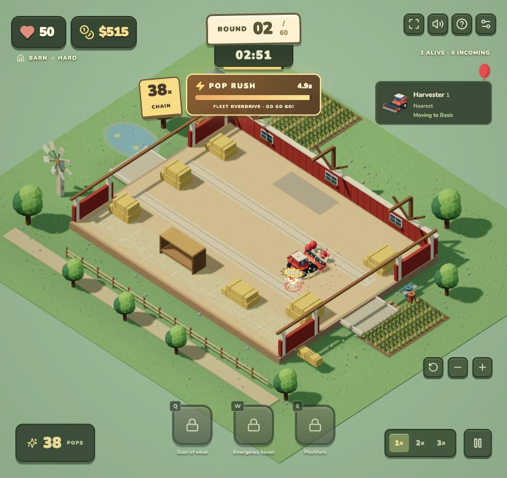
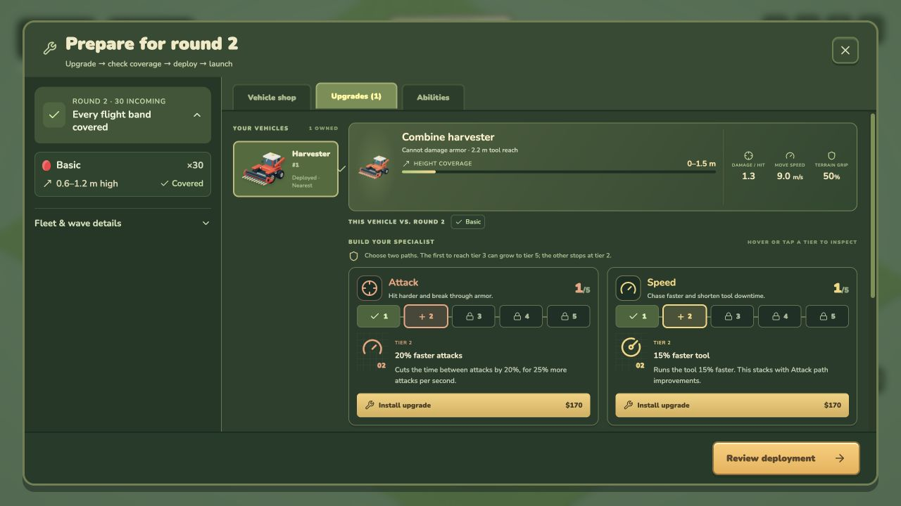

# Balloon Arena Defense

[](https://github.com/egeozcan/arena-defense/actions/workflows/pages.yml)
[](LICENSE)

**[Visit the landing page](https://egeozcan.github.io/arena-defense/) · [Play now](https://egeozcan.github.io/arena-defense/play/)**

A playable desktop browser auto-battler based on [the supplied design document](DESIGN.md). Build a fleet of toy farm and construction vehicles, place them in an isometric arena, and clear every balloon within three simulation minutes. Waves arrive in tight packs, with a 0.7-second launch and chain-triggered Pop Rush overdrive to keep the action moving.

## Screenshots

Pop Rush in the barn arena:



The preparation workshop, with upgrades and an incoming-wave briefing:



## Run locally

```sh
git clone https://github.com/egeozcan/arena-defense.git
cd arena-defense
npm ci
npm run dev
```

Open the URL printed by Vite (normally http://127.0.0.1:5173) for the landing page; append `/play/` for the game. Requires Node.js 22.12 or newer (CI uses Node.js 24). Playing needs a desktop browser with WebGL, a mouse, and a keyboard. No account or backend is required; saves stay in your browser.

```sh
npm run build       # TypeScript checks and production bundle
npm test            # Determinism and gameplay regression tests
npm run balance     # Full Easy, Medium and Hard campaigns in both arenas
npm run balance:frontier # Check every legal vehicle build for dominance/dead upgrades
npm run balance -- --plan=expanded # Exercise the eight-vehicle roster
npm run balance -- --plan=basic # Compare a modest four-vehicle fleet
npm run balance -- --mode=hard --arena=yard --seed=73429
```

## GitHub Pages deployment

[The Pages workflow](.github/workflows/pages.yml) runs the gameplay tests and production build on pushes to `main` and pull requests. Successful pushes to `main` deploy `dist/` through GitHub Actions to [the live site](https://egeozcan.github.io/arena-defense/). Pull requests validate without publishing; the workflow also supports manual runs.

The build includes a lightweight landing page at `/` and the game at `/play/`. CI sets Vite's base to the repository path so JavaScript, styles, vehicle images, and screenshots work on GitHub Pages. To preview that exact deployment locally:

```sh
npm run build -- --base=/arena-defense/
npm run preview -- --base=/arena-defense/
# Open http://127.0.0.1:4173/arena-defense/
```

For a fork, enable **Settings → Pages → Source → GitHub Actions**. CI derives the base path from your repository name; update the account-specific README, landing-page, and package links for your fork.

## Play

1. Buy a vehicle from the bottom tray (**1–8**) and click a clear area to deploy its ghost. **R** rotates; **Esc** cancels placement. Select a deployed vehicle to move it or change targeting.
2. Press **Enter** or **Start wave**. After the countdown, vehicles drive and attack automatically. **Space** or **Esc** pauses; **1–3** set simulation speed, which persists between waves. Round earnings open directly in the preparation workshop with your upgrade options and the next wave briefing.
3. Chain **10 pops**, with no gap longer than **2.5 simulation seconds**, to trigger **Pop Rush**: the entire fleet moves **45% faster** and attacks **60% faster** for **5 seconds**. The gold meter shows charge and remaining overdrive; the chain badge shows your streak. Pops during Rush grow the streak but do not refill or extend it. Paid boosts stack with Rush up to 2.5× movement / 2.6× tool speed. Round results record Rush count and best chain.
4. Select a vehicle in the arena or the live fleet panel to change its **Strategy** during a wave, inspect its current activity, or activate its unlocked unique ability. Use **Q**, **W**, and **E** for purchased global abilities.
5. Between waves, press **G** to open the garage for upgrades, purchases, and abilities. The workshop opens automatically after each match. Its wave briefing lists exact incoming counts, initial height bands, armor, splitting cargo and other modifiers. Coverage is checked against deployed vehicles, including upgrades; uncovered bands offer deployment or purchase suggestions. New types and higher flight bands are announced a round ahead. Review deployment before launching; uncovered balloons or undeployed vehicles trigger a pre-launch check that you can choose to proceed through. If every remaining balloon is outside your fleet’s coverage, **End wave** lets you accept the displayed life loss rather than wait for the timer; abilities remain available if you want to rescue the wave.

Use the view buttons to zoom and rotate; right-drag pans. **V** rotates the camera; **+ / −** zoom. The settings icon starts a new run with Easy, Medium, or Hard difficulty in either arena. Progress saves locally during preparation. Reloading during a round returns to its saved preparation state. The sound icon toggles synthesized effects. Round summaries can export JSON replays.

## Implemented

- Eight detailed procedural vehicles with reflective glass, sculpted tires, chevron treads, metal wheel spokes, grilles, steps, and working headlamps, brake lamps, reversing lamps, and steering indicators. Wheeled vehicles use individual steering angles and signed wheel rotation; crawlers animate belt links and rollers independently on each side. Textured cutaway arenas include scenery, foliage, lighting, and shadows.
- Every upgrade tier adds cumulative physical hardware and blends the body paint with its path color. Attack reinforces and transforms tools; Speed adds intakes, exhausts, turbo hardware and overdrive cores; Traction adds larger tires, rotating tire chains, wider crawler cleats, guards, plows and recovery equipment. Specialist tiers add vehicle-specific equipment including rear and raised headers, thresher turbines, radial fog cannons, demolition jaws, wrecking balls, magnets and tower-crane outriggers. Mounting zones keep both paths visible in combined builds. Upgraded models appear in the arena, placement ghosts and the garage's selected-vehicle preview; stock purchase icons remain baked images. The icon studio has primary and secondary path controls for inspecting all tiers and combinations.
- Vehicle handling uses gradual acceleration and braking, momentum, limited steering, slower corners, reversing, terrain-dependent grip, and separate differential steering for crawlers. Harvester rear steering and sprayer front steering follow the motion model. Damped chassis pitch and roll show weight transfer; crawler upper bodies slew independently of their tracks. Heading, suspension, tools, wheels, and tracks follow simulation ticks and interpolation, including pause and speed changes. Visible route lookahead rounds grid corners. Wheeled vehicles predict collision-free sequences of turns and reverses, brake before route endpoints, and recover when small maneuvers stop making progress. Unreachable approaches ask parked vehicles to yield early. Harvesters face their primary target with the front cutter; the upgraded rear header adds secondary hits behind the chassis.
- Vehicle icons are transparent renders of those same models, shared across the garage, fleet controls, inspector, and help. To regenerate them, open `/tools/vehicle-icons.html` on the development server and bake each icon into `public/vehicles/`.
- Expanded arenas: a 48 × 36 m barn and a 64 × 48 m yard, with wider circulation lanes, crop fields, a pond and windmill, loading bays, marked roads, a site office, lights, and a tower crane. Camera framing adapts to arena dimensions.
- Vehicles retain their fast movement and attacks. The opening wave now has 30 balloons; later scripted counts are 1.8× their base scripts before difficulty scaling. Packs hold 10/13/16 balloons before difficulty scaling and arrive within roughly 4–11 seconds. After the opening, entrances alternate and packs use a wider spread of lanes. Upgrade prices reflect each path's utility; specialist roles, life rules, and payouts retain their existing rules.
- Layered pop bursts with radial sparks, colorful shards, expanding shockwaves, balloon hit flashes, weapon recoil, brighter spray, dust trails, wind streaks, and boost glows. Small camera kicks respect reduced-motion preferences.
- Pop Rush turns chains into five seconds of fleet-wide overdrive. A tick-driven charge meter and chain fuse freeze when paused and follow the selected simulation speed. Golden exhaust, synchronized ignition rings, a brief camera push, a comic callout, and a rising synthesized chord mark the payoff. Locally drawn, instanced POP! stamps appear at bursts without font downloads or per-pop draw calls; screen flashes are reserved for Rush ignition. Camera motion and callout animations respect reduced-motion preferences.
- Synthesized impact sounds rise with a streak, with a wave-clear jingle and round highlights for best chain and Rush activations. The Rush mechanic and highlights are deterministic in replays.
- Camera controls, terrain-sensitive movement, A* routing to reachable attack positions, and immediate retargeting after a pop or loss of eligibility. Nearest uses travel cost to tool range; balloons already in range are ordered by distance. Other vehicles' target claims only break ties, so they cannot override a strategy.
- Live per-vehicle strategy controls and activity indicators, including explicit height and armor limits when a specialist idles. Strategy changes are timestamped replay commands and carry forward to the next wave.
- Chassis collisions use swept movement checks, vehicle-width clearance around obstacles, and occupied space in A*. Vehicles replan blocked routes, pull aside for traffic, and rotate right of way to avoid starvation. Blocked attackers ask idle or attacking vehicles on their route to move aside, then keep the exit clear until they finish moving. Pulling aside continues if the last eligible target is popped; losing that target previously froze the vehicle in place. Traction tier 4 speeds recovery while retaining collisions. Older saves relocate conflicting deployments to the nearest clear placement.
- Hay balers launch travelling piercing bales that stop at scenery; Bale Press upgrades add range, pierce, faster firing, wider bales and a straw burst. Bale Barrage fires three shots in a fan. Blower trucks herd packs toward nearby teammates with directional air bursts; Airflow upgrades add range, a wider cone, stronger wind, extra altitude reach and a gathering vortex. Downburst temporarily lowers a nearby group, including armored balloons, so low tools can help. Bulldozers sweep low armored packs with a front blade; Blade upgrades widen and raise it. Concrete mixers splash clustered targets at mid height; Drum upgrades grow the splash and improve armor damage. All four have animated models, baked shop icons and shared upgrade paths.
- Five balloon types; layered splitting, armor resistance, hay drops, fleeing and regeneration.
- Visible balloon drift with distinct speeds: Basic 0.95, Layered 0.8, High-flyer 0.75, Carrier 0.5, and Armored 0.32 m/s before difficulty and physics effects. Balloons begin drifting inward, hold a heading for 3–5 simulation seconds, and may dodge nearby vehicles at their next decision. Fleeing modifiers dodge more aggressively. Heading choices avoid walls and low scenery; physics still handles contact and bounces.
- A 60 Hz simulation using deterministic Rapier WASM, seeded waves, physics body reuse, stable entity order and timestamped ability commands.
- Vehicle purchases, 70% resale, all four five-tier upgrade paths with the two-path/5+2 cap, targeting modes, persistent placement and local saves.
- Three global abilities with cooldown and charge upgrades; eight vehicle abilities unlocked through unique upgrades.
- 20 scripted waves, generated later waves, three difficulty modes, victory, game over, and freeplay.
- Confetti, optional synthesized pop sounds, live HUD, time controls and round payouts.

## Difficulty and balance

Modes share the same introductions, so armor arrives at round 6, high-flyers at round 8, and carriers at round 10. Difficulty changes the actual wave pressure:

| Mode   | Win / lives     | Crowd vs. Easy | Wave pressure                                                                                       |
| ------ | --------------- | -------------- | --------------------------------------------------------------------------------------------------- |
| Easy   | 20 rounds / 150 | 1×             | Lower prices, light late modifiers, no added armor during the campaign                              |
| Medium | 40 rounds / 100 | 1.15×          | Tighter packs, faster drift, growing specialist HP, added armor from round 30                       |
| Hard   | 60 rounds / 50  | 1.35×          | Faster packs and drift, stronger specialist HP, earlier fleeing/regrowth, added armor from round 22 |

Basic and layered balloons retain one HP during the campaign to preserve fast popping. Durable specialist targets gain HP after round 8 in Medium and Hard. Starting cash stays $650; price multipliers remain 0.85 / 1 / 1.08. Income is $160 + $2 per round, plus normal pop earnings. A successful wave adds a speed bonus of $0.65 per remaining second, capped at $100 / $85 / $70, so a fast opening no longer grants an oversized windfall. Timer and weighted life penalties remain consistent across modes. Overflow balloons queued beyond the 300-body physics limit count toward life loss at timeout.

The balance runner uses actual affordability, placement, legal upgrades, collisions, and ability cooldowns. Its expanded plan reserves all eight roles before adding extra excavators and sprayers; advanced investments prioritize layer removal and wide armor coverage before support capstones. It chooses Attack-primary cranes and blowers to cover armored air crowds, with Specialist-primary ground tools; the Airflow support branch is exercised in the tool/ability tests. Reports include queued balloons and remaining types so a timeout can be diagnosed. Its balanced plan buys all four original roles, grows the fleet, and invests in advanced upgrades and abilities. Its basic plan keeps four vehicles with upgrades capped at tier 2 and uses no abilities. Reports include every round and are saved under `artifacts/balance-*.json`. These are deterministic scenario checks, not measured human win rates.

The older `balance-balanced-*` and `balance-basic-*` reports predate the larger arenas and denser rounds and remain historical baselines. Earlier `balance-expanded-*` reports exercise the six-vehicle roster; reports from different fleet plans are scenario evidence rather than a guarantee that every composition wins. Run the balance command to reproduce a plan against the current rules.

The eight-vehicle expanded plan cleared all 20 Easy barn rounds with no lives lost. In a 12-round Medium yard check, it survived with 80 lives; ten high-flyers escaped in round 9 while the fleet had one crane. Earlier six-vehicle expanded checks cleared Easy and Medium in both arenas and Hard in the barn. A historical Hard yard check also exposed limited aerial pursuit. These fixed plans test selected fleet choices, not every possible build.

### Vehicle tradeoffs and upgrade commitments

Stock prices are $400 / $450 / $550 / $700 / $500 / $600 / $575 / $675 before difficulty scaling. Each tool keeps a reason to buy it and a gap for another vehicle to cover:

| Vehicle   | Distinct job                               | Attack as primary                                                         | Specialist as primary                                                                         | Persistent limitation                                                             |
| --------- | ------------------------------------------ | ------------------------------------------------------------------------- | --------------------------------------------------------------------------------------------- | --------------------------------------------------------------------------------- |
| Harvester | Cheapest tool, rapid wide ground cuts      | Armor access and heavy cuts; secondary Header reaches 2 m                 | Rear cuts, 3 m height and crowd pull                                                          | Specialist cannot damage armor; Attack cannot reach high-flyers                   |
| Sprayer   | Fastest chassis, ranged cone crowds        | Heavy spray, 75% armor damage, secondary 60° cone                         | Slowing, full armor damage, acid stripping and 360° fog                                       | Never reaches above 4 m; low base terrain grip                                    |
| Excavator | Full armor damage and strong base traction | Tier 3 gives 50% bonus armor damage; heavy crushing with secondary splash | Larger reach, shockwaves and complete layered-balloon removal                                 | Never reaches above 5 m; slower pursuit                                           |
| Crane     | Heavy high-altitude hits                   | Two armor-breaking hooks; secondary Boom keeps 12 m height coverage       | Carrier slowing/lowering, two splash hooks, 12 m range and 14 m height; travels at half speed | Cannot pop low cargo; Specialist cannot damage armor                              |
| Baler     | Long-range travelling, piercing shots      | Heavy bales with 62.5% armor damage; secondary press pierces 8            | Faster, wider 12-target bales, barrage and endpoint straw bursts                              | No high coverage; Specialist retains 25% armor damage; scenery blocks shots       |
| Blower    | Herding and airborne pack support          | Damages armored air packs; secondary Airflow widens its cone              | 9 m air range, strong wind, gathering vortex, 14 m height and group Downburst                 | Low direct damage; Specialist cannot damage armor; Downburst needs a low teammate |
| Bulldozer | Short-range armored ground crowds          | Heavy 87.5%-armor blade sweeps; Blade stops at tier 2                     | Wider, higher blade, slowing rubble and front Blade sweep                                     | No high coverage; must face targets and close distance                            |
| Mixer     | Ranged mid-height splash                   | Heavy concrete blasts with 75% armor damage; Drum stops at tier 2         | Larger splash, slowing concrete and full armor damage                                         | Slow firing; never reaches high-flyers                                            |

Speed emphasizes pursuit and sustained tool cadence; tier 5 adds another 15% drive speed so it improves one-hit swarms even when tier 4 already refreshes tool overdrive on every pop. Traction emphasizes handling in mud and traffic; tier 5 also adds 20% drive speed, including on vehicles already at full grip. Both remain useful as secondary investments, but choosing either as the primary path caps Attack and Specialist at tier 2. Harvesters, cranes and blowers then need an armor partner. No legal build independently covers the whole altitude-and-armor combination. The garage explains each primary commitment before purchase.

Airflow tier 4 also increases horizontal reach to 9 m: its benefit applies to normal high-flyers, which stay within stock 12 m altitude coverage. Boom tier 4 slows nearby carriers by 60% and lowers those above 3 m to 3 m, within raised-header coverage. Carrier spawn bands are 2.5–3.5 m, so the old 4 m lowering effect could not help. Neither change raises low balloons. Demolisher trades pop income and Pop Rush charge for fewer targets: destroying a layered balloon awards only its outer pop, while leaving the splits to other tools earns their extra rewards.

Upgrade prices are incremental multiples of the chassis price; each purchase is rounded after difficulty scaling. Earlier purchases and 70% resale use the actual amount paid, so existing saves keep their recorded investment.

| Path       | Tier 1 | Tier 2 | Tier 3 | Tier 4 | Tier 5 |
| ---------- | ------ | ------ | ------ | ------ | ------ |
| Attack     | 0.30   | 0.50   | 0.90   | 2.00   | 4.00   |
| Speed      | 0.20   | 0.35   | 0.70   | 1.40   | 2.50   |
| Traction   | 0.15   | 0.25   | 0.50   | 0.90   | 1.60   |
| Specialist | 0.30   | 0.50   | 1.20   | 2.40   | 4.50   |

`npm run balance:frontier` enumerates all **936 legal builds** (117 per chassis) in all three price modes. A build is dominated if another costs no more, is no worse on every modeled capability, and is strictly better on at least one. Dimensions include actual height/armor targeting, damage and HP breakpoints, cold and sustained tool cadence, reach and tool geometry, terrain speed/handling, chassis clearance, traffic recovery, and support mechanics/abilities. It also checks every legal next upgrade for a benefit. Combat shares geometry, armor and timing helpers with the audit; regression tests exercise armor, group hits, abilities, movement, and fractional attack cooldowns. Fractional cooldowns preserve advertised speed gains at 60 Hz instead of rounding two different upgrades to the same interval.

The audit currently reports no dominated builds or dead upgrades and writes `artifacts/vehicle-frontier.json`. This is a frontier of modeled individual capabilities, not proof of equal usefulness in every wave: fleet synergy, firing lanes, player timing and campaign affordability still need the separate simulation checks and playtesting.

### Loose hay: terrain and balance analysis

Selected rounds now add loose hay in the travel lanes of both arenas. The first is round 4, followed by 7, 10, 13, and every third round afterward. There are four bales initially, five from round 13, six from round 25, seven from round 37, and eight from round 49. The arena, round, and run seed determine the layout. Preparation shows the same layout used by combat and reserves the bales' space when placing vehicles; deployments covered by a new layout move to the nearest legal space. The larger stacked hay at the arena edges remains fixed scenery. Surviving carriers drop additional loose bales every 20 seconds when the landing spot is clear, up to 20 active bales including the initial layout.

A loose bale is 1.4 × 1 × 0.9 m. It blocks driving, low balloon drift, and travelling bale projectiles. Routes consider clearance and the cost of clearing or pushing, so a capable vehicle can still choose a short detour. Crushing stops the vehicle for a brief clearing interval, then removes the obstacle and physics collider for everyone. Pushing moves the actual obstacle and collider, leaves the bale in play, and needs an empty destination. Walls, stacks, teammates, and other bales cannot be pushed through. Vehicles cannot chain-push a row of bales. These interactions are deterministic and run on simulation ticks, including carrier drops and route updates.

| Chassis | Stock hay behavior | Stock cost | Collision radius | Useful terrain role | Remaining compromise |
| --- | --- | ---: | ---: | --- | --- |
| Harvester | Clears in about 0.72 s | $400 | 1.12 m | Fastest stock clearing; opens a lane for the fleet | Front alignment, large chassis, low height, and no stock armor damage |
| Sprayer | Detours | $450 | 0.95 m | Fast small chassis can take side gaps or spray from a distance | Weak mud grip; pushing requires Traction as the primary path |
| Excavator | Clears in about 1.12 s | $550 | 0.95 m | Small tracked armor tool; pivots and clears blocked approaches | Slower pursuit, slower clearing than the harvester, and no high-altitude coverage |
| Crane | Detours | $700 | 1.12 m | Can engage high targets from beyond a hay lane | Large, slow, and unable to pop low cargo; Boom-primary cannot unlock hay pushing |
| Baler | Pushes at up to 2.08 m/s | $500 | 1.12 m | Opens a firing lane without abandoning piercing damage | Low shots can hit hay; stock pushing fails in deep mud |
| Blower | Detours | $600 | 0.95 m | Small chassis and ranged herding reduce the need to enter blocked lanes | Low direct damage and ground blind spot; Traction-primary gives up advanced Airflow |
| Dozer | Pushes at up to 2.40 m/s | $575 | 1.12 m | Strong stock pushing; tracked turns and low armored crowd damage | Must close and face targets; pushing needs room; Blade tier 3 switches to crushing |
| Mixer | Pushes at up to 2.08 m/s | $675 | 1.12 m | Can shift hay away from ranged splash positions | Slow fire rate, large chassis, and stock pushing fails in deep mud |

Costs are before difficulty multipliers. Clearing times assume continuous contact and include the 60 Hz tick rounding. They are a delay rather than balloon damage: Attack upgrades do not clear hay faster. Every Traction tier adds 12% of the chassis' base clearing rate; a tier-5 harvester takes about 0.45 s per bale, an excavator 0.70 s, and a Blade-upgraded dozer 0.57 s. Even maximum traction preserves that delay.

Push speed and force come from chassis grip and Traction upgrades. Stock balers and mixers can push on ordinary surfaces but fail the force threshold on deep mud. Traction tier 1 fixes that specific gap. Traction tier 3 adds extra pushing force and enables pushing on sprayers, cranes, and blowers. Maximum pushing speed is 2.64 m/s for a sprayer, 3.12 for a crane, 3.04 for a baler or mixer, 2.88 for a blower, and 3.36 for a pushing dozer. Boosts, Pop Rush, and Speed upgrades improve pursuit and attacks but cannot exceed these contact speeds or replace missing pushing force. Blade tier 3 trades the ability to reposition a bale for permanent clearance; it does not keep both modeled capabilities.

Size and agility affect different choices. The 2.2 m gap probe admits all 117 builds of each small chassis—sprayer, excavator, and blower—and none of the five larger chassis: **351 of 936 builds** pass. Traction cannot make a large vehicle fit a small gap. Crawlers can pivot without rolling; cranes have a lower maximum pivot rate than excavators and dozers. Wheeled vehicles need rolling space and may reverse before turning. Full-lock steering has a nominal 1.89 m centerline turn radius, and lateral grip limits corner speed to about 4.13 m/s on full grip. Increasing straight-line speed therefore does not erase the advantage of a compact tracked vehicle in a tight approach. Actual steering and acceleration remain subject to the movement tests and collision sweeps; route length alone does not measure turn time.

#### Every upgrade combination has an opportunity cost

The audit covers all **117 legal builds per chassis**, including stock, single paths, low-tier two-path builds, and every legal primary/secondary tier pairing. That is **936 builds in each of Easy, Medium, and Hard**. [The per-build report](artifacts/hay-build-balance.json) records each build's actual purchase costs, hay handling, mud speed, strengths, limitations, marginal upgrade gains/losses, and six route probes: clear floor, an avoidable bale, a bale pinned by scenery, a narrow gap, a muddy lane, and a hay-filled corridor without a detour. The existing frontier audit now also models hay crushing, pushing speed/force, chassis size, and tracked pivot rates.

These are the twelve fully invested 5+2 families. The two paths can be bought in either order; whichever reaches tier 3 becomes the primary commitment. A cost multiple includes the chassis and all seven purchases, before per-purchase rounding and mode scaling.

| Primary 5 + secondary 2 | Cost / chassis price | Benefit | Cost of the choice |
| --- | ---: | --- | --- |
| Attack + Speed | 9.25× | Highest damage branch plus earlier pursuit and faster tools | No traction investment or advanced specialist geometry; light chassis still detour around hay |
| Attack + Traction | 9.10× | Damage with better handling, stronger native pushing, or faster clearing | Traction 2 cannot enable pushing on light chassis; no specialist expansion or Speed cadence |
| Attack + Specialist | 9.50× | Damage plus early range, cone, splash, or piercing improvements | Hay handling and grip stay stock; advanced specialist support remains unavailable |
| Speed + Attack | 6.95× | Pursuit, permanent tool overdrive, and early damage/cadence | Attack 2 gives no new armor access; no advanced specialist tools or hay mobility |
| Speed + Traction | 6.55× | Pursuit and handling; native pushers gain force and crushers clear faster | Light chassis still cannot push; no damage or specialist investment |
| Speed + Specialist | 6.95× | Pursuit and early tool geometry or reach | Stock hay handling and mud grip; no advanced armor or crowd-control unlocks |
| Traction + Attack | 5.20× | Reliable mud travel and hay access, with early damage/cadence | Attack stops before armor bypass; no advanced specialist geometry or permanent tool overdrive |
| Traction + Speed | 4.95× | Cheapest fully invested pair; grip, recovery, hay access, pursuit, and faster tools | No Attack or Specialist investment; no advanced damage, armor bypass, or support ability |
| Traction + Specialist | 5.20× | Grip and hay access with early range, splash, cone, or pierce | Specialist stops before its ability and advanced support effects; no damage investment |
| Specialist + Attack | 10.70× | Signature tool, ability, and early damage/cadence | Most expensive family; no new Attack armor bypass and no mobility investment |
| Specialist + Speed | 10.45× | Signature tool and early pursuit/tool cadence | No traction or Attack investment; stock hay behavior unless the tool itself changes it |
| Specialist + Traction | 10.30× | Signature tool with better grip, clearing, or native pushing | Traction 2 does not unlock light-chassis pushing; no damage or Speed investment |

Lower-tier variants preserve money and upgrade options but have less capability. Their exact price and last-tier benefit appear in the report rather than assuming a capstone is always worth buying. The frontier checks cost as well as capability: an upgrade must add a real modeled benefit, and another build must not offer every modeled benefit at an equal or lower price. The normal hay-corridor probe is accessible to **648 builds**: 255 crushers and 393 pushers. The other 288 builds must use a detour or teammate, while the small-gap advantage applies to a different set of 351 builds. All three modes currently report **936 frontier builds, zero dominated builds, and zero dead upgrades**. This does not imply equal strength in every wave or that any single build can win a campaign.

The chassis-specific limitations in the preceding vehicle table still apply to all twelve families. Harvester, crane, and blower mobility/specialist primaries retain their armor gap because Attack cannot reach tier 3. Sprayers, balers, excavators, dozers, and mixers retain a high-altitude gap. Advanced Chemicals and Drum can solve their own armor weakness while giving up Traction-primary hay access. Boom 5 doubles down on ranged coverage but halves travel speed and leaves a large chassis detouring around hay. Demolisher removes layered targets efficiently but gives up split-pop cash and Rush charge. Blade 3 makes the dozer a lane clearer, while a stock/Attack/Speed/Traction-primary dozer keeps the positioning tradeoff of pushing. Wide Bale Press shots also trade projectile clearance for crowd coverage: their 0.65 m radius clips more low hay/scenery approaches than the stock 0.35 m radius. This loss is included in the audit. These gaps preserve reasons to mix the fleet.

#### Campaign comparison

The expanded plan was checked through round 13 (seed 73429), with paired hay/clear runs in all six mode/arena combinations. Five combinations reached round 13 in both conditions; Medium yard ended at round 11 in both.

| Mode / arena | Final lives, clear → hay | Average wave seconds, clear → hay | Hay crushed / pushed | Outcome |
| --- | ---: | ---: | ---: | --- |
| Easy / barn | 150 → 150 | 43.6 → 41.3 | 8 / 4 | Reached round 13 |
| Easy / yard | 150 → 150 | 60.0 → 61.1 | 5 / 3 | Reached round 13 |
| Medium / barn | 100 → 100 | 43.9 → 43.5 | 8 / 0 | Reached round 13 |
| Medium / yard | 0 → 0 | 76.0 → 74.0 | 7 / 4 | Both lost at round 11 |
| Hard / barn | 28 → 28 | 73.4 → 73.9 | 10 / 1 | Reached round 13 |
| Hard / yard | 38 → 40 | 83.4 → 82.7 | 7 / 5 | Reached round 13 |

The expanded Medium-yard failure is an affordability/coverage problem in that purchasing policy: its five deployed chassis at failure are harvester, sprayer, baler, excavator, and dozer. It never buys a crane or blower before the high waves. All escapes on rounds 8, 9, and 11 are high-flyers, with exactly the same weighted life loss in the paired runs (36, 52, and 42). Hay changes ground-wave routes and rewards but does not create this altitude gap. A fleet needs to reserve money for high coverage before buying more ground roles or shallow upgrades.

The supplemental [coverage-focused Medium-yard run](artifacts/balance-balanced-73429-medium-yard-hay.json) survived through round 13 with **68 lives**, using five vehicles and buying high coverage earlier. It still lost six lives on round 9 and 26 on round 13, all from high-flyers. Its average wave time was 81.3 s. This illustrates a practical tradeoff: fewer different ground roles and stronger coverage survive where the breadth-first plan fails; neither policy makes aerial pursuit free. Reproduce it with `npm run balance -- --plan=balanced --mode=medium --arena=yard --rounds=13 --hay=on`.

[Hay campaign data](artifacts/balance-expanded-73429-easy-medium-hard-barn-yard-hay.json) and [clear-floor counterfactual](artifacts/balance-expanded-73429-easy-medium-hard-barn-yard-clear.json) retain all per-round results and final upgrades.

Hay did not call for a blanket damage or price change in these checks: individual builds retain modeled advantages, campaign life outcomes stayed similar in the paired conditions, and the failed policy can survive by changing its purchases. Existing Traction prices remain lower than damage/specialist prices, while the primary-path requirement prevents cheap secondary grip from erasing light vehicles' terrain weakness. Full campaign and additional-seed playtesting remain necessary to judge practical build popularity.

The paired runner uses the expanded fleet plan, the same seed, the same difficulty, the same arenas, and the same purchase/ability policy. `--hay=off` removes loose terrain and carrier drops for the counterfactual; it retains the final vehicle and routing rules. Differences include the resulting balloon movement, firing lanes, clear rewards, deployment fits, and later affordable purchases. A faster hay run can therefore arise from altered clustering or routing; hay is not required to make every wave slower. The evidence covers the early game through the fifth initial bale and the first armor/high/carrier introductions, rather than claiming a completed Medium or Hard campaign or human win rates.

Reproduce the checks with `npm test`, `npm run build`, `npm run balance:frontier`, and `npm run balance:hay`. For the paired campaign: `npm run balance -- --plan=expanded --rounds=13 --hay=on` and the same command with `--hay=off`. Reports include hay remaining, distinct bales pushed, and bales crushed for each round. Seeds and layouts reset each wave; changing terrain during a wave does not overwrite the next round's preparation state.

### Oil and rough ground: exhaustive build analysis

Selected rounds now generate visible, seeded driving surfaces in both arenas. Rough ground starts on round **5**, then returns every five rounds; oil starts on **7**, then returns every five rounds. Mixed rounds start on **13**, then return every five rounds. A single-surface round has three patches; a mixed round has two of each. Opening rounds and intervening clear rounds preserve opportunities to favor damage, specialist tools, and speed. The briefing counts patches and warns one round before a new surface type appears.

Each patch is 6–8 m wide and 4–6 m deep. Even the largest mixed layout covers at most 11.1% of the barn or 6.25% of the yard. Patches stay away from gates and fixed scenery, leave dry routes, allow deployment, and can share space with loose hay. They do not block projectiles or affect flying balloons. Preparation and combat regenerate the same layout from arena, round, and seed; older saves need no migration.

Oil and rough ground create different decisions. Oil retains much of straight-line speed while reducing acceleration, braking, corner speed, and crawler pivot rate. Rough ground imposes rolling resistance as well as reduced handling. A* and target distance fields include terrain costs. The steering rollout samples surfaces throughout each predicted arc, and route smoothing checks terrain cost before cutting a corner across a patch. Vehicles also use surface grip while braking to attack or stop.

#### Movement measurements

The rules use the existing chassis traction rating plus 0.1 per Traction tier for the first two tiers, capped at 1. Effective handling is `min(1, surface grip + 0.5 × chassis traction)`. Oil grip is 0.18; rough grip is 0.32. Traction tier 3 adds 0.2 to rough/mud grip, **with no oil bonus**. Oil's straight-line speed factor is `0.65 + 0.35 × handling`; rough's is `0.85 × handling`. Traction tier 5 restores both factors to 1 and retains its existing 20% drive-speed bonus. Tool damage and attack cadence are unaffected by the surface itself.

These stock measurements use the real fixed-step driving model on a uniform surface, without boosts, traffic, targets, or collisions. Braking begins at a common 6 m/s to compare control rather than each chassis' top speed. The columns are speed limits, not guaranteed pursuit averages.

| Chassis | Medium stock cost | Oil handling | Oil speed limit | Rough speed limit | Oil braking distance from 6 m/s | Main surface advantage | Compromise |
| --- | ---: | ---: | ---: | ---: | ---: | --- | --- |
| Harvester | $400 | 43% | 6.24 m/s | 3.78 m/s | 2.41 m | Fastest stock rough-ground travel; clears hay | Short frontal tool needs close pursuit and alignment; armor/high targets need support |
| Sprayer | $450 | 33% | 6.74 m/s | 3.52 m/s | 3.16 m | Highest straight oil speed; compact chassis can take dry gaps | Weakest oil control; long braking, low corner speed, and only half armor damage |
| Excavator | $550 | 58% | 4.44 m/s | 3.18 m/s | 2.34 m | Best stock oil handling; pivots, clears hay, hits armor fully | Slow travel/attacks; no high coverage; smaller splash needs Specialist investment |
| Crane | $700 | 48% | 3.76 m/s | 2.42 m/s | 2.84 m | Range and pivoting can avoid entering a patch | Slowest rough travel; large footprint; ground cargo and stock armor remain blind spots |
| Baler | $500 | 45.5% | 5.50 m/s | 3.44 m/s | 2.28 m | 7 m firing reach and piercing can exploit a dry lane | Hay can block shots; 25% armor damage; no high coverage |
| Blower | $600 | 40.5% | 5.70 m/s | 3.34 m/s | 2.57 m | Herds air packs toward teammates without crossing every patch | Weak independent damage/control, no ground coverage, stock armor immunity |
| Dozer | $575 | 55.5% | 4.90 m/s | 3.43 m/s | 2.45 m | Good control, pivot steering, ground armor sweeps | Short frontal reach forces patch crossings; blade height remains limited |
| Mixer | $675 | 45.5% | 5.02 m/s | 3.14 m/s | 2.28 m | Ranged splash can cover patches from dry firing positions | Slow firing, large chassis, half armor damage, no high coverage |

For wheeled machines, full-lock corner speed on oil is about **2.37 m/s for a stock sprayer**, versus **4.13 m/s at full handling**. Raising straight-line speed cannot remove that bound. Crawlers retain stationary pivoting, but the excavator's stock oil pivot rate is only 1.28 rad/s, versus 2.2 on full grip. Tracks therefore provide useful control without making a slow chassis the best pursuer everywhere.

#### Traction's five tiers

| Tier | Benefit | Opportunity cost or limitation |
| --- | --- | --- |
| 1 | Small oil/rough handling gain, better pushing and faster hay clearance | No damage, height, range, or tool-rate gain; dry routes can make the purchase unnecessary |
| 2 | A second handling increment; remains legal as a secondary path | Occupies the second path; stronger surface specialization remains unavailable after committing another primary |
| 3 | +0.2 mud/rough grip, stronger pushing, hay pushing unlocked on light chassis | Commits Traction as primary; excludes advanced Attack/Specialist; does not improve oil control over tier 2 |
| 4 | Faster traffic recovery and further hay handling improvements | Oil/rough movement factors match tier 3 on an empty lane; benefit depends on traffic/hay |
| 5 | Full oil control, no rough slowdown, +20% drive speed | Expensive and requires the primary path; still no additional damage/altitude coverage or room through narrow gaps |

For example, a sprayer progresses from **3.52 m/s rough travel and 3.16 m oil braking** at stock to **4.26 m/s and 2.41 m** at Traction 2. Traction 3 raises rough travel to **5.76 m/s**, while oil braking stays at **2.41 m**. Traction 5 gives **10.56 m/s** surface speed limits and restores **1.01 m** braking from 6 m/s. Medium purchase totals are $450, $631, $856, and $1,981 respectively, before buying a secondary path. The capstone costs over four stock sprayers, and it gives up sticky spray/acid or advanced Attack. An excavator at Traction 3 already reaches full rough handling, but still travels at only 85% of its speed because stones retain rolling resistance; tier 5 still has a real benefit.

#### All vehicle/upgrade combinations

`npm run balance:terrain` writes `artifacts/terrain-build-balance.json`: **936 individual records**, covering all 117 legal builds on each of eight chassis. Each record includes purchase totals in all difficulties, explicit pros and cons, actual surface acceleration/braking measurements, oil/rough/dry speed and handling, hay interaction, eight navigation probes, and the marginal benefits/costs/losses of each invested path's last tier. Stock, single-path, partial two-path, 2+2, and all legal primary+secondary builds are included; illegal third paths or two primary paths are excluded.

The 12 fully invested pair families have the following terrain implications. Costs below are approximate total chassis-price multiples; each purchase is rounded separately in the garage. Partial builds trade later unlocks for saved cash, and 2+2 builds preserve the choice of which existing path will become primary.

| Primary 5 + secondary 2 | Total cost | Advantage | Remaining compromise |
| --- | ---: | --- | --- |
| Attack + Speed | 9.25× | Damage/armor breakpoints, faster tools and pursuit | Stock grip; cornering and rough-ground routes can limit pursuit despite high speed |
| Attack + Traction | 9.10× | Damage plus affordable oil control and rough handling | No Speed or Specialist; tier 2 cannot unlock rough bonus or light-chassis hay pushing |
| Attack + Specialist | 9.50× | Strong hits plus early reach, splash, cone, or pierce | Stock mobility/control; careful dry positioning or a clearing teammate matters |
| Speed + Attack | 7.20× | Sustained tool rate, pursuit, early damage | Stock grip; Attack stops before armor bypass; no signature geometry |
| Speed + Traction | 6.80× | Pursuit/tool rate plus some oil control | No Attack/Specialist; rough tier 3 and full oil control remain locked out |
| Speed + Specialist | 6.95× | Rapid tools with early range/geometry for dry-lane firing | Stock grip and no advanced armor/support tools |
| Traction + Attack | 5.20× | Full control, hay/traffic recovery, some stronger/faster hits | Damage remains modest; no Speed or specialist reach/geometry; armor-immunity chassis still need support |
| Traction + Speed | 4.95× | Cheapest full pair; full control, pursuit, faster tools | No Attack/Specialist investment; cannot buy armor bypass or crowd-control abilities |
| Traction + Specialist | 5.20× | Full control plus early ranged/area geometry | No damage/Speed upgrades; signature abilities and advanced height/armor transformations remain locked |
| Specialist + Attack | 10.70× | Signature tool/support plus stronger hits and faster tools | Stock mobility; harvesters/cranes/blowers still lack independent armor damage |
| Specialist + Speed | 10.45× | Signature reach/control, pursuit, tool cadence | Stock surface control; oil still bounds corners and braking |
| Specialist + Traction | 10.30× | Signature tool plus modest oil/rough control | No Attack/Speed; tier 2 cannot buy rough bonus, recovery, or light-chassis pushing |

Chassis identity persists in every family: harvesters/dozers must align a short frontal tool; sprayers trade top speed against the weakest control; excavators trade strong control and armor damage against pursuit/altitude limits; cranes trade high coverage against ground blindness and slow travel; balers trade piercing reach against firing-lane clearance; blowers trade independent damage against team herding; mixers trade ranged splash against firing cadence and altitude. Boom 5 still halves crane travel, wide Bale Press shots still need more projectile clearance, and Hydraulics 5 still sacrifices split-pop income and Pop Rush charge. Terrain does not erase any of those specialist costs.

The updated cost/capability frontier has **936 undominated builds in Easy, Medium, and Hard**, **zero dead legal next upgrades**, and **zero missing pro/con records**. No build independently covers the entire ground/high-and-armor combination. The 2.2 m gap still admits only the three small chassis: 351 builds. This is evidence against a strictly inferior purchase on the modeled capabilities; it is not proof that all builds have equal win rates or are equally popular. Terrain creates useful mobility alternatives without requiring a blanket vehicle-price or damage change.

#### Paired campaign evidence

The expanded purchasing policy was run with surfaces on/off for **two seeds × both arenas × all three difficulties**, through round 13 or defeat: 24 campaigns, 12 pairs. Loose hay and carrier drops remain enabled in both conditions. `artifacts/terrain-campaign-comparison.json` summarizes the pairs; the complete round-by-round runs are saved in the corresponding `balance-expanded-*-surfaces-on/off.json` files.

| Seed | Difficulty | Arena | Lives lost, surfaces on / off | Mean wave seconds, on / off | Outcome |
| --- | --- | --- | ---: | ---: | --- |
| 73429 | Easy | Barn | 2 / 2 | 53.3 / 53.5 | Both reach round 13 |
| 73429 | Easy | Yard | 6 / 6 | 57.5 / 56.5 | Both reach round 13 |
| 73429 | Medium | Barn | 0 / 0 | 46.0 / 44.7 | Both reach round 13 |
| 73429 | Medium | Yard | 130 / 6 | 76.6 / 68.9 | On loses on round 11; off reaches 13; averages cover different horizons |
| 73429 | Hard | Barn | 0 / 0 | 62.9 / 60.8 | Both reach round 13 |
| 73429 | Hard | Yard | 16 / 16 | 82.8 / 82.9 | Both reach round 13 |
| 73531 | Easy | Barn | 0 / 0 | 40.8 / 39.9 | Both reach round 13 |
| 73531 | Easy | Yard | 0 / 0 | 57.6 / 54.2 | Both reach round 13 |
| 73531 | Medium | Barn | 0 / 0 | 44.5 / 44.7 | Both reach round 13 |
| 73531 | Medium | Yard | 0 / 0 | 64.9 / 63.9 | Both reach round 13 |
| 73531 | Hard | Barn | 2 / 2 | 72.0 / 69.2 | Both reach round 13 |
| 73531 | Hard | Yard | 58 / 58 | 75.9 / 74.1 | Both lose on round 11 |

Eleven pairs preserve the same life-loss outcome; one exposes a purchase-policy threshold. On Medium Yard, seed 73429, rough round 5 takes 65.5 s instead of 40.0 s. The speed-based clear bonus leaves $694 after round 6 instead of $705. The policy misses the $700 crane, buys a $575 dozer, then spends on ground-tool upgrades. Its fleet has **no high-altitude counter**, so rounds 8, 9 and 11 lose 36, 52 and 42 lives to high-flyers. Those defeat rounds have no initial surface patches: the failure is the downstream budget and coverage choice, not an unavoidable oil barrier. A coverage-focused four-role `balanced` plan survives the terrain-on case through 13 with 74 lives and five vehicles; buying every role is not always the right early strategy.

The runner also supports `--reserve-air=on`: once round 7 arrives, it defers other purchases and upgrades until it can buy a crane. In the failed Medium Yard case, this leaves four vehicles on round 7, buys the crane on round 8, and reaches round 13 with **all eight roles, 94 lives, and a 66.9 s mean wave time**. Life loss returns to the six-life terrain-off result without changing chassis stats, damage, prices, or wave composition. The original policy and its failed report remain available; the reserve variant writes a separate `-air-reserve.json` file. Reproduce it with `npm run balance -- --plan=expanded --mode=medium --arena=yard --rounds=13 --seed=73429 --surfaces=on --reserve-air=on`.

The terrain change therefore adds meaningful economic and movement choices, with a real cost for pursuing role variety before necessary coverage. It does not justify making every build win independently: altitude gaps, armor gaps, handling, clearing delays, and cash commitments are intended tradeoffs. The build frontier and marginal checks remain clean, while a brittle purchasing policy can fail. Human playtesting and full 20/40/60-round campaigns are still needed to judge practical build popularity and late-game difficulty. These runs cover the first rough, oil, mixed, armor, high, and carrier rounds, not completed campaigns or measured human win rates.

Reproduce the complete checks with `npm test`, `npm run build`, `npm run balance:frontier`, and `npm run balance:terrain`. For paired campaigns, use `npm run balance -- --plan=expanded --rounds=13 --seed=73429 --surfaces=on`, repeat with `--surfaces=off`, and repeat both with seed 73531. The surface counterfactual retains loose hay, carrier drops, waves, difficulty, and the purchase/ability policy. Reports record patch counts each round and include the surface setting in their filenames.

## Code

- `src/sim/data.ts`: costs, stats, upgrade descriptions, terrain, arenas, wave scripts and run model.
- `src/sim/pathfinding.ts`: A* and terrain-weighted target distance fields.
- `src/sim/hay.ts`: loose-bale contact prediction, pushing clearance, grip requirements, clearing rates, and routing resistance.
- `src/sim/traffic.ts`: swept chassis collisions, occupied route cells, and pull-aside recovery.
- `src/sim/vehicle-motion.ts`: fixed-step vehicle handling, steering, signed running-gear travel, and suspension.
- `src/sim/vehicle-driving.ts`: collision-checked steering and reversing sequences, with front-cutter positioning for harvesters.
- `src/sim/balloon-motion.ts`: timed drifting, evasive heading choices, and clearance around scenery.
- `src/sim/pop-rush.ts`: simulation-tick chain tracking, charge and bounded overdrive duration.
- `src/sim/engine.ts`: browser-independent fixed-tick physics, AI, combat, commands and payouts.
- `src/render/`: React Three Fiber scene, instanced balloons and procedural toy models.
- `src/ui/`: React garage, HUD, run flow and styling.
- `tools/`: Node-based determinism tests and balance runner.

The renderer reads simulation state; user actions enter a command queue. Pause and speed only change tick scheduling. The replay export records the starting run and each input tick.

## Prototype limits

This is a first playable implementation, rather than the design document's fully validated release. Models are procedural rather than Blender/glTF assets. Chassis use circular collision proxies and planar steering dynamics; suspension and articulated tools remain visual. Barn loft hiding, true ramp climbing, and exact tool collider shape queries are still simplified. Later waves use seeded per-type counts rather than the proposed constraint-based budget generator. The fog cannon uses repeated radial hits instead of a persistent damage-over-time volume. Freeplay beyond the scripted balance scenarios needs more playtesting; the 300-balloon frame-rate target has not been certified on a mid-range laptop. There is replay export and deterministic replay verification in tests, but no in-app replay viewer.

The compatibility physics package embeds WASM, so the production bundle is currently sizable. Fonts use Google Fonts with local sans-serif fallbacks. No external image or model assets are required.

## License

Copyright © 2026 Yavuz Ege Özcan. This game, its procedural artwork, and the screenshots in this repository are licensed under the **GNU General Public License, version 3 only** (`GPL-3.0-only`). See [LICENSE](LICENSE) for the full terms. The program is provided without warranty. Third-party dependencies retain their respective licenses.
